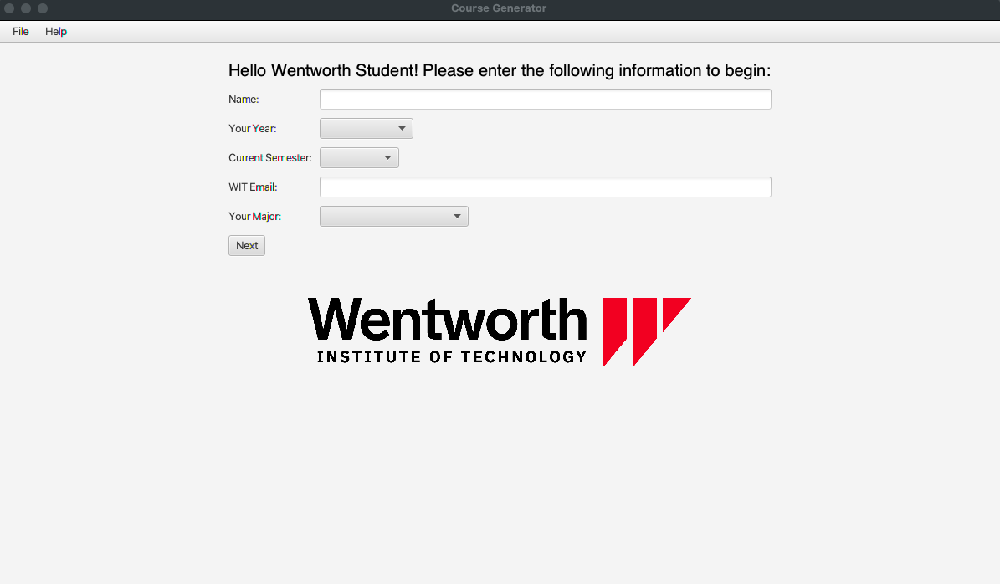
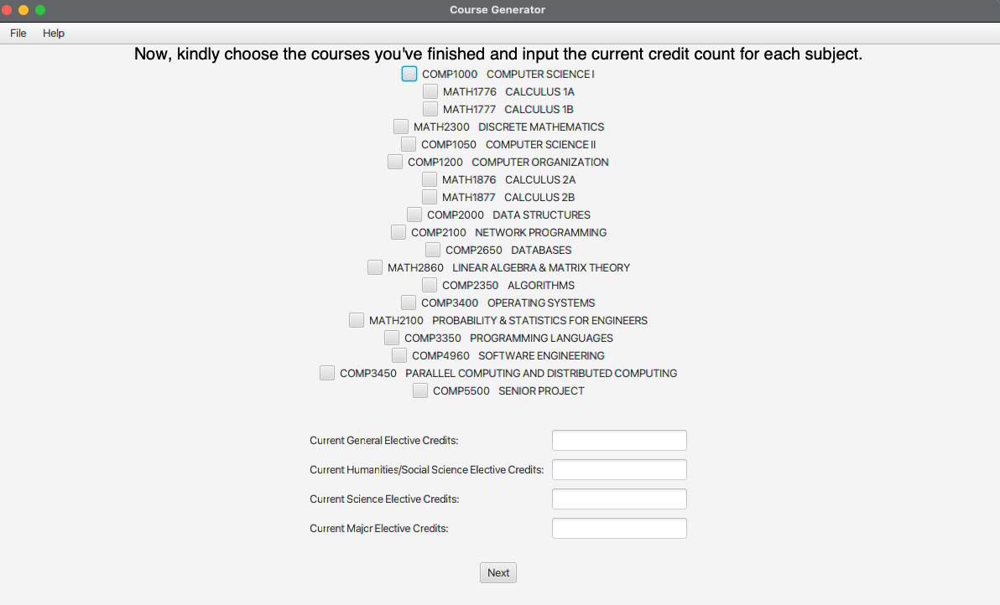
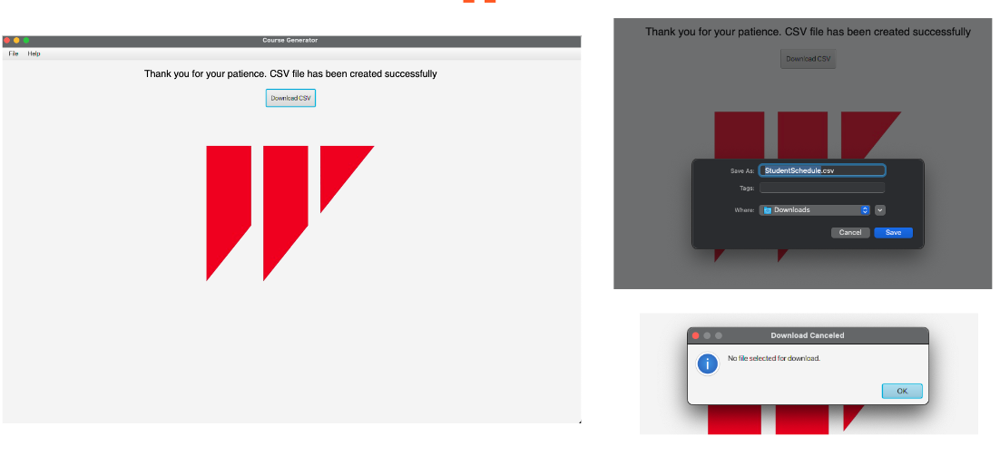
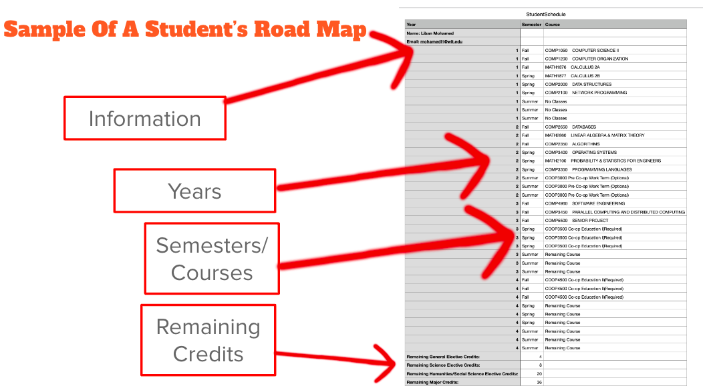

# Course Scheduler

## Overview

Course Scheduler is a Java-based desktop application developed using Java and JavaFX. The project aims to provide a user-friendly tool for Wentworth students and academic advisors to efficiently schedule courses, simplifying the process and ensuring accurate planning. 

## Features

1. **User Interface:**
    - Implemented a visually appealing and interactive user interface using JavaFX.
    - Intuitive design to enhance the user experience and ease of navigation.

2. **Course Selection:**
    - Empowers users with a streamlined course selection process.
    - Utilizes an adjacency list algorithm to track prerequisite classes, ensuring accurate and efficient scheduling.

3. **CSV Roadmap Generation:**
    - Generates a comprehensive college roadmap in CSV format for future semesters.
    - Offers users the convenience of downloading and organizing their schedules.

## Screenshots

### Welcome Page

### Course Selection

### CSV Download Screen

### CSV Format

## How to Use

1. Clone the repository to your local machine.

2. Open the project in your preferred Java IDE.

3. Run the application and explore the user-friendly interface.

4. Follow the on-screen instructions to select courses and generate your college roadmap.

5. Download the CSV file for future reference.

## Dependencies

- Java
- JavaFX

Happy scheduling! 📅✨